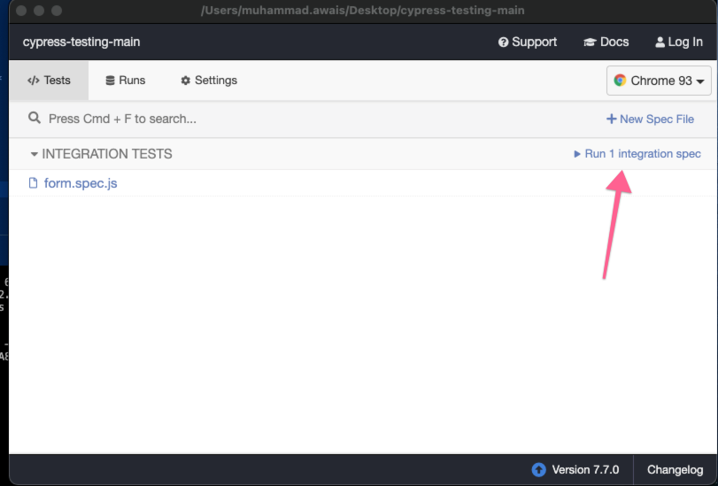

# Javascript-Cypress-CI-Visibility
 
## Compatibility 
Cypress >= 6.7.0
From dd-trace>=1.4.0

## Prerequisites
 [Install the Datadog Agent to collect tests data](https://docs.datadoghq.com/continuous_integration/setup_tests/agent/?tab=azurepipelines)

 <br/>

[Install the Javascript tracer](https://github.com/DataDog/dd-trace-js) 

## How to Use:
Run NPM Install command
```
npm install 
```
Run npm test command below
```
DD_ENV=ci npm test  
```
<br/>
Click on run test below when cypress window opens <br/>



## Results:
Should be shown in datadog ci after a couple of minutes:
https://app.datadoghq.com/ci/test-runs?index=citest&start=1632627253983&end=1632630853983&paused=false

## Documentation
https://docs.datadoghq.com/continuous_integration/setup_tests/javascript/?tab=cypress
